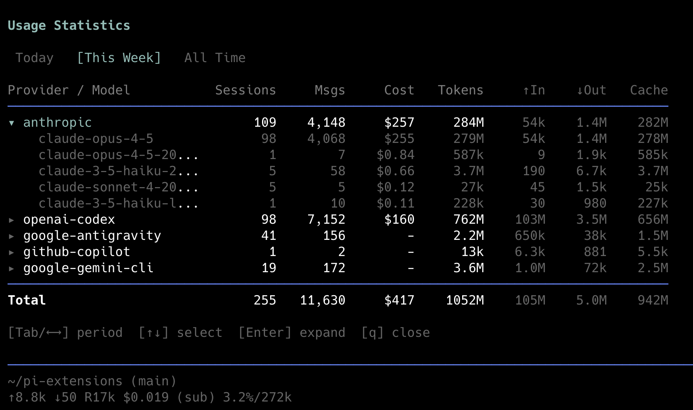
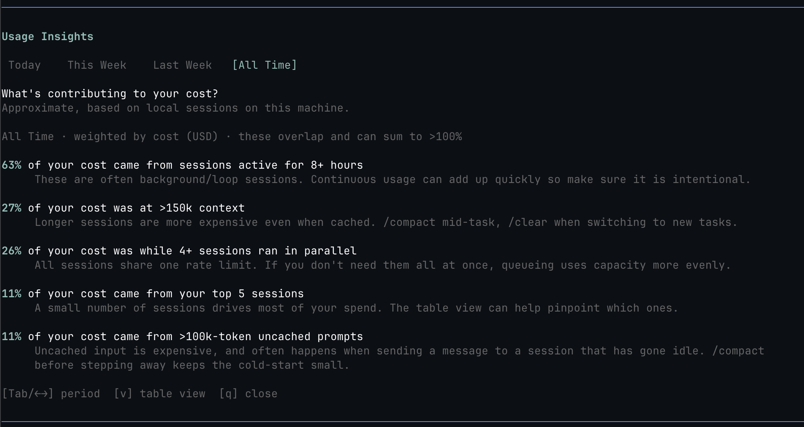

# /usage - Usage Statistics Dashboard

A Pi extension that displays aggregated usage statistics across all sessions.



## Compatibility

- **Pi version:** 0.42.4+
- **Last updated:** 2026-04-19 (0.3.1)

## Installation

### Pi package manager

```bash
pi install npm:@tmustier/pi-usage-extension
```

```bash
pi install git:github.com/tmustier/pi-extensions
```

Then filter to just this extension in `~/.pi/agent/settings.json`:

```json
{
  "packages": [
    {
      "source": "git:github.com/tmustier/pi-extensions",
      "extensions": ["usage-extension/index.ts"]
    }
  ]
}
```

### Local clone

Add to your `~/.pi/agent/settings.json`:

```json
{
  "extensions": [
    "~/pi-extensions/usage-extension"
  ]
}
```

## Usage

In Pi, run:
```
/usage
```

## Features

### Views

`/usage` has two view modes, toggled with `v`:

- **Table** (default) — per-provider / per-model stats with cost and token breakdown (screenshot at the top of this page).
- **Insights** — narrative characteristics of your cost for the active time period, e.g. *"X% of your cost was at >150k context"*. Insights are **independent characteristics**, not a breakdown, so they overlap and can sum to more than 100%.



**Unit:** insights are always weighted by recorded API cost (USD). Periods with no recorded cost show an explicit empty state rather than silently switching to a different unit.

The insights currently shown:

| Insight | Threshold |
|---|---|
| Parallel sessions | ≥ 4 sessions active within an exact ±2 min window |
| Large context | `input + cacheRead + cacheWrite > 150k` |
| Large uncached prompt | `input + cacheWrite > 100k` |
| Long-running sessions | session lifetime ≥ 8 hours (global, not per-period slice) |
| Top-session concentration | top 5 sessions by cost |

### Time Periods (modal)

| Period | Definition |
|--------|------------|
| **Today** | From midnight (00:00) today |
| **This Week** | From Monday 00:00 of the current week |
| **Last Week** | Previous week (Monday 00:00 → this Monday 00:00) |
| **All Time** | All recorded sessions |

Use `Tab` or `←`/`→` to switch between periods.

### Usage Widget (Footer)

A live usage widget appears **above the editor** whenever Pi is running. It provides at-a-glance cost tracking without interrupting your workflow.

#### Modes

Press `Ctrl+Alt+U` to cycle through five display modes:

1. **Summary** — single-line total cost for the current scope

   ```
   Usage: $0.123 (Today)
   ```

2. **Compact** — per-provider breakdown

   ```
   Usage (Today):
     Deepseek: $0.123
     Google: $1.200
   ```

3. **Detailed (Collapsed)** — full table with providers only

   ```
   Usage (Today)              Sessions     Msgs     Cost   Tokens     ↑In    ↓Out   Cache
   ──────────────────────────────────────────────────────────────────────────────────────
   ▸ google                          5       25  $10.254   888.1k  800.1k     88k     19k
   ▸ deepseek                        1        5  $0.0014     8.3k    7.3k     999     19k
   ──────────────────────────────────────────────────────────────────────────────────────
   ```

4. **Detailed (Expanded)** — full table with models nested under each provider

   ```
   Usage (Today)              Sessions     Msgs     Cost   Tokens     ↑In    ↓Out   Cache
   ──────────────────────────────────────────────────────────────────────────────────────
   ▾ deepseek                       38      839    $1.16     2.2M      2M    157k     19k
       deepseek-v4-pro              25      718    $1.11     1.9M    1.8M    145k     12k
       deepseek-v4-flash            13      121    $0.06     298k    265k     12k      7k
   ▾ google                          8       37    $0.32     449k    349k    100k     19k
       gemini-3.1-pro-preview        3        7    $0.21      85k     75k     10k      4k
       gemini-3.1-flash-li...        4       28    $0.10     347k    262k     85k     14k
       gemini-flash-latest           1        1  $0.0089      31k     26k      5k      0k
   ──────────────────────────────────────────────────────────────────────────────────────
   ```

5. **Hidden** — widget is not shown

#### Scopes

Press `Ctrl+Shift+U` to cycle time scopes:

- Last Hour
- Today
- Yesterday
- This Week
- Last Week
- This Month
- All Time

#### Formatting

- **Cost**: always 3 decimal places (e.g. `$0.123`, `$1.200`). Zero shows as `-`.
- **Tokens**: follows Pi conventions:
  - 0–999: raw number
  - 1k–9.9k: `X.Xk`
  - 10k–999k: `Xk`
  - 1M–9.9M: `X.XM`
  - 10M+: `XM`

#### Real-time Updates

The widget updates automatically:

- Within ~1 second after each assistant message completes
- Every 30 seconds to capture background subagent activity

#### Settings

Run `/usage-settings` to open the interactive settings menu. It lets you customize:

- **Display Mode** and **Time Scope** defaults
- **Theme Preset** with live preview (7 themes: Default, Tokyo Night, Dracula, Gruvbox, Nord, Catppuccin, Monokai)
- **Customize Layout** — per-mode column visibility and ordering, grouped into Settings (Totals Row, Headers, Header/Footer Lines) and Columns sections. Press `r` on a column to reorder with live preview.
- **Custom Theme Colors** — override colors per visual element (headers, values, separators)

Settings persist across sessions in `~/.pi/agent/pi-usage-widget-settings.json`.

#### Defaults

On startup, the widget defaults to **Summary** mode and **Today** scope.

### Timezone

Time periods are calculated in the local timezone where Pi runs. If you want to override it, set the `TZ` environment variable (IANA timezone, e.g. `TZ=UTC` or `TZ=America/New_York`) before launching Pi.

### Columns

| Column | Description |
|--------|-------------|
| **Provider / Model** | Provider name, expandable to show models |
| **Sessions** | Number of unique sessions |
| **Msgs** | Number of assistant messages |
| **Cost** | Total cost in USD (from API response) |
| **Tokens** | Fresh tokens for the turn: input + output + cache write |
| **↑In** | Fresh input tokens: input + cache write *(dimmed)* |
| **↓Out** | Output tokens *(dimmed)* |
| **Cache** | Cache read + write tokens *(dimmed; informational)* |

> **As of 0.2.0:** `Tokens = Input + Output + CacheWrite` and `↑In = Input + CacheWrite`. `CacheRead` stays out of `Tokens` so repeated cache hits don't swamp the dashboard. The dashboard itself shows a one-line footer reminder.

On narrow terminals, `/usage` automatically switches to a compact table instead of overflowing the terminal. Hidden columns reappear as soon as you widen the terminal.

### Navigation

| Key | Action |
|-----|--------|
| `Tab` / `←` `→` | Switch time period |
| `↑` `↓` | Select provider *(table view)* |
| `Enter` / `Space` | Expand/collapse provider to show models *(table view)* |
| `v` | Toggle between Table and Insights view |
| `q` / `Esc` | Close |

## Provider Notes

### Cost Tracking

Cost data comes directly from the API response (`usage.cost.total`). Accuracy depends on the provider reporting costs.

### Cache Tokens

Cache token support varies by provider:

| Provider | Cache Read | Cache Write |
|----------|------------|-------------|
| Anthropic | ✓ | ✓ |
| Google | ✓ | ✗ |
| OpenAI Codex | ✓ | ✗ |

The "Cache" column combines both read and write tokens.

`Tokens` and `↑In` include cache writes but intentionally exclude cache reads. That keeps totals aligned with fresh/billed prompt work without letting repeated cache hits swamp the dashboard.

## Data Source

Statistics are parsed recursively from session files in `~/.pi/agent/sessions/`, including nested subagent runs such as `run-0/` directories. Each session is a JSONL file containing message entries with usage data.

Assistant messages duplicated across branched session files are deduplicated by timestamp + total tokens, matching the extension's previous behavior while still including recursive subagent sessions.

Respects the `PI_CODING_AGENT_DIR` environment variable if set.

## Changelog

See `CHANGELOG.md`.
